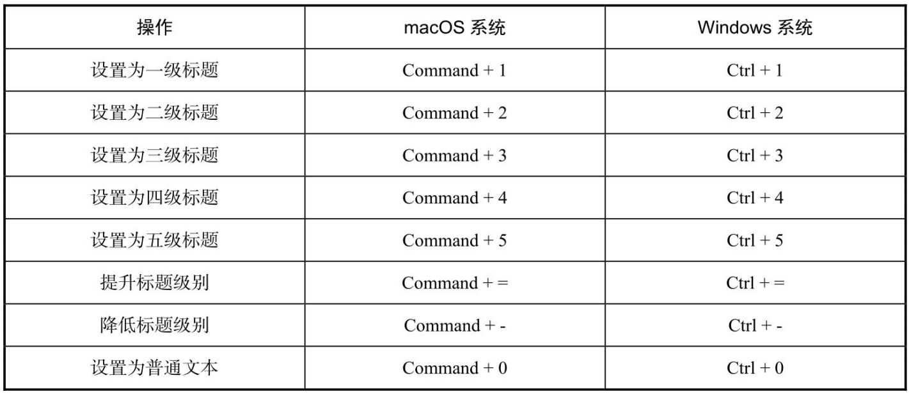

**注：此文档由于编辑器排版和功能等原因导致有些内容尚不完善，一些格式无法被正常使用，本文档纯个人学习使用，仅供参考**


# 一、基础语法

## 1.1 字体格式

*斜体*

---

**粗体**

***

***粗斜体***

***

<u>下划线</u>

---

~~删除线~~

***

这是^上标^

---

这是~下标~

***

==高亮==

---

footnote[^脚注]


<a id="section1"></a>

## 1.2 列表

### 1.2.1 有序列表

1. 有序列表1
2. 有序列表2
3. 有序列表3

### 1.2.2 无序列表

* 无序列表1

  * 无序列表1.1

    *无序列表1.1.1

* 无序列表2

* 无序列表3

### 1.2.3 任务列表

- [ ] 未完成1
- [ ] 未完成2

- [x] 已完成
- [ ] 未完成3


## 1.3 图片链接

### 1.3.1 图片


### 1.3.2 链接

#### 1.3.2.1 外部链接

[google](www.google.com "谷歌")

这是[谷歌][google]

<https://www.google.com/>

#### 1.3.2.2 内部链接

**点击[此链接](#section1)传送至列表**

**点击[此链接](#1.2 列表)传送至列表**(注意要把标题打完整，包括前方序号)


## 1.4 代码块

### 1.4.1 行内代码

这是python的hello world代码`print("hello,world!")`

### 1.4.2 单独代码块

以下为无格式代码:

```
def printhello():
	print("hello,world!")

printhello()
```


以下为python格式代码:

```python
def printhello():
	print("hello,world!")

printhello()
```


## 1.5 引用

> 引用内容1
>
> > 嵌套引用内容
>
> 引用内容2


## 1.6 表情

:smile:

:+1:

:grinning:

:clown_face:


## 1.7 表格

| 表头1(默认) | 表头2(靠左) | 表头3(居中) | 表头4(靠右) |
| :---------- | :---------- | :---------: | ----------: |
| 111         | 222         |     333     |         444 |


## 1.8 数学公式（LaTex格式）

### 1.8.1 行内公式

考察 $ f(x,y) = \frac{x^2}{y^3} $ 的性质

### 1.8.2 公式块

$$
f(x,y) = \frac{x^2}{y^3}
$$

$$
\mathbf{V}_1 \times \mathbf{V}_2 =  \begin{vmatrix}  \mathbf{i} & \mathbf{j} & \mathbf{k} \\ \frac{\partial 
X}{\partial u} &  \frac{\partial Y}{\partial u} & 0 \\ \frac{\partial X}{\partial v} &  \frac{\partial Y}{\partial v} & 0 \\ \end{vmatrix}
$$


# 二、排版技巧

## 2.1 空格

### 2.1.1 加空格

> 1. 中英文间
>
> 2. 中/英文和数字间
> 3. 英文标点(, . ; : ?) 后面加前面不加
> 4. \< 或 > 标识路径时前后都要加

### 2.1.2 不加空格

> 1. 中文标点和英文、数字、中文间
> 2. 数字和百分号间
> 3. 数字和单位间
> 4. 英文和数字组合成名字间
> 5. /表示“或”和“路径”时
> 6. 货币符号后


## 2.2 标点符号

> 1. 中文排版用全角
> 2. 英文排版用半角


## 2.3 Typora 的快捷键

### 2.3.1 编辑文本


### 2.3.2 设置标题




### 2.3.3 列表


### 2.3.4 其他常用快捷键

1. 添加表格：**Ctrl + T**

2. 引用：**Ctrl + Shift + Q**

3. 围栏代码块：**Ctrl + Shift + K**

4. 打开文件：**Crtl + O** 
5. 打开上一个文件：**Ctrl + Shift + T**
6. 查看最近文件：**Ctrl + P**
7. 选择 :

>1. 当前词：**Ctrl + D**
>2. 当前行：**Ctrl + L**
>3. 当前格式：**Ctrl + E**
>4. 全选：**Ctrl + A**

8. 删除当前词：**Ctrl + Shift + D**

9. 查找和替换：

> 1. 查找面板：**Ctrl + F**
> 2. 查找并替换面板：**Ctrl + H**
>
> 2. 上一个：**F3**
> 3. 下一个：**Shift + F3**

10. 跳转：

> 1. 文首：**Ctrl + Home**
> 2. 文尾：**Ctrl + End**

11. 全屏：**F11**

---

以下为引用注释：

[google]:https://www.google.com/

[^脚注]: 此即脚注使用方式

